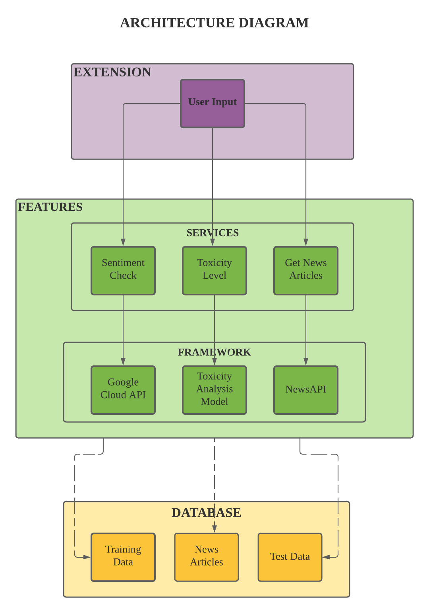

# Gain Perspective

## Inspiration

In recent times, social media has become a huge part of our day-to-day life. It has connected people from different parts of the world and supported numerous businesses. However, with all the benefits, there is also a worrying trend of increasing toxic content in these same platforms. This has resulted in several mental health issues as well as caused an increase in the spread of fake news. Thus, our team felt that something should be done to control the spread of this toxicity and misinformation. Hence, we came up with our very own extension called 'Gain Perspective.'

## What it does

Gain Perspective is a chrome extension that takes user's inputs and provides them with toxicity ratings on those input. Thus, a user could check whether a particular post or tweet is hate-speech content or not. Furthermore, it also suggests relevant articles from credible sources like CNN, BBC etc. to the user so that he/she can improve his/her knowledge and be more well-informed on the same.

## How we built it

This extension is built using HTML, CSS and javascript. The backend scripts are written in python and deployed using flask. We utilised tensorflow and nltk for training our sentiment analysis model and used the Google-Language-API for polarity detection and entity detection.

## Challenges we ran into

1. Finding data to train our sentiment analysis model.
2. Reducing the time taken by our server to respond upon receiving API calls.

## Accomplishments that we're proud of

1. We built a sentiment analysis model with a high accuracy.
2. We successfully integrated our extension with our backend models.
3. We designed a responsive and user-friendly extension for Google Chrome.

## What we learned

1. We learned how to build extensions for Google Chrome.
2. We gained knowledge in sentiment analysis and entity recognition.

## What's next for Gain Perspective

This extension could be integrated inside of various social media platforms for easier access and regulation of the content posted on these same platforms.
